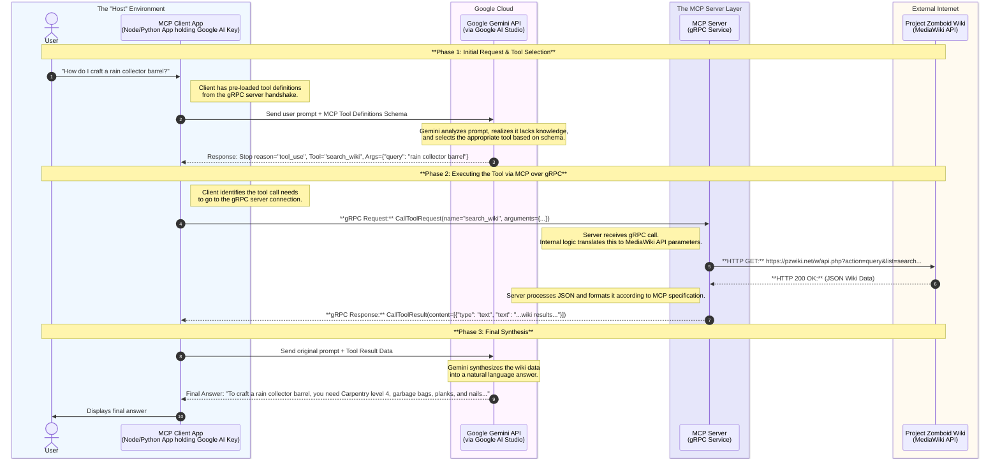
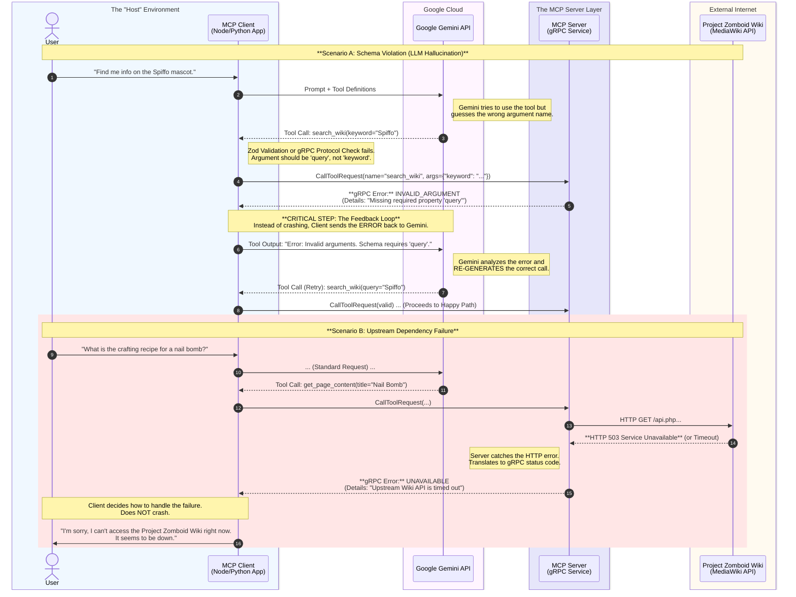

# Project Structure

The project is a distributed system consisting of three main components:

1. **The MCP Client (The Brain/Orchestrator):**
    * **Role:** This is the application that the user interacts with (e.g., a CLI tool, a web app, or an IDE plugin).
    * **Responsibilities:**
        * Manages the conversation with the user.
        * Holds the connection to the LLM (Google Gemini).
        * Knows how to call tools but doesn't know what the tools do internally.
        * Talks to the MCP Server via gRPC.
2. **The MCP Server (The Tool Shed):**
    * **Role:** A standalone microservice (running locally or on a server).
    * **Responsibilities:**
        * Exposes specific functions ("tools") to the Client: `search_wiki`, `get_page_content`, etc.
        * Validates inputs (e.g., ensuring a search query is a string).
        * Handles the actual logic of calling the external API (Project Zomboid Wiki).
        * Returns structured data (JSON) back to the Client.
3. **The External Resource (The Knowledge Base):**
    * **Role:** The Project Zomboid Wiki (MediaWiki API).
    * **Responsibilities:**
        * Provides the raw data about the game.
        * Responds to HTTP requests from your MCP Server.

## Happy Path

This diagram illustrates the successful execution of a user request where everything works as expected.

### Key Components of the Happy Path

* **Schema Handshake:** At the start (not shown in the diagram for simplicity), the Client asks the Server "What tools do you have?" and sends those definitions to Gemini. This ensures Gemini knows exactly what it can ask for.
* **Zero Hallucination (Ideally):** Because Gemini is grounded by the strict tool definitions (Zod schemas), it is much less likely to invent fake API calls.
* **Separation of Concerns:** The Client handles the "intelligence" (talking to the user and the LLM), while the Server handles the "mechanics" (fetching data). This makes your system modular and easier to maintain.

## Sad Path

There are some common causes to errors in distributed systems:

1. **Schema Validations:** LLM mistakes
2. **Transport Failures:** gRPC / Network issues
3. **Upstream Failures:** The Wiki API is down

### Solutions

1. **The Self-Correction Loops (Steps 4-7):**
    * This is the most powerful part of agentic AI. When the MCP Server throws a validation error (e.g., `ZodError`), you don't show it to the user. You feed it back to the LLM as a "Tool Output."
    * Gemini is smart enough to read the error message ("property 'keyword' does not exist"), look at the schema again, and issue a new request with the correct arguments automatically.
2. **gRPC Status Mapping:**
    * You need to map HTTP errors from the Wiki to gRPC status codes in your server:
        * **HTTP 404 (Not Found):** `NOT_FOUND` (or return empty list).
        * **HTTP 500/503 (Server Error):** `UNAVAILABLE`.
        * **Network Timeout:** `DEADLINE_EXCEEDED`.
        * **Bad Zod Schema:** `INVALID_ARGUMENT`.
3. **Circuit Breaking:**
    * If the Wiki is returning 503s repeatedly, your MCP Client should probably stop asking Gemini to call tools for a few minutes to prevent cascading failures (though for a simple chat app, a simple try/catch is usually sufficient).
